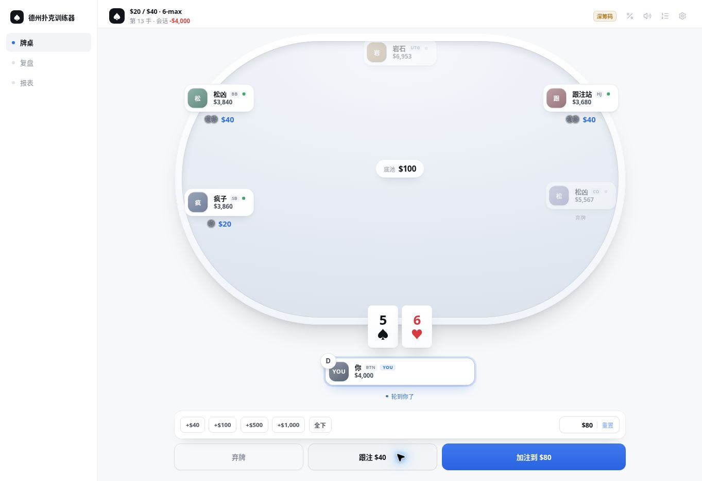
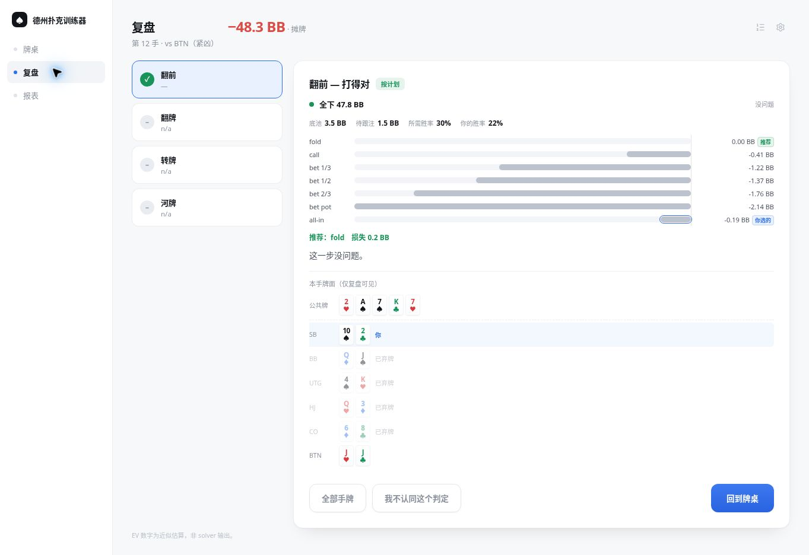
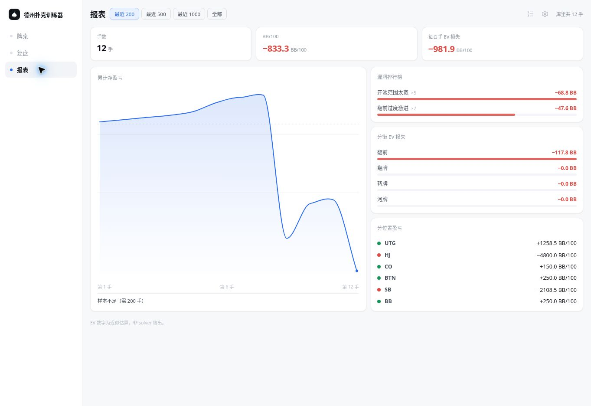

# 德州扑克模拟训练器

[](https://github.com/Haotian14/Texas_Hold/actions/workflows/ci.yml)
[](https://texas-hold.luohaotian0616.workers.dev/)
[](LICENSE)

一个离线可用的德州扑克训练器：完整打牌、保存手牌，并在每手结束后告诉你哪一步打错、亏了多少 BB，以及长期反复出现的漏洞。

**[立即体验](https://texas-hold.luohaotian0616.workers.dev/)** · 支持桌面端、移动端和 PWA 安装



## 为什么做它

普通扑克 Demo 只负责把牌发出来；这个项目关心的是训练闭环：

```text
打牌 → 保存 HandRecord → 估算候选动作 EV → 标记失误 → 单手复盘 → 长期漏洞统计
```

AI 对手、实时胜率读数和复盘使用同一套范围感知 EV 链路，避免出现“复盘建议弃牌，但 AI 在相同局面从不弃牌”的口径分裂。

## 核心能力

- 完整 6-max 无限注德州扑克引擎：合法动作、边池、全下、摊牌与筹码守恒。
- 六种 AI 性格与全 GTO 模式，基于范围和 EV 选择动作。
- 逐决策点复盘：实际 EV、推荐动作、损失 BB、严重度和 15 类漏洞标签。
- 历史记录与数据报表：按位置、街道和错误类型聚合，支持 JSON 导入导出。
- 可复现牌局：随机性全部来自 seed，同一 seed 可以重放完全相同的牌局。
- IndexedDB 本地持久化、Service Worker 离线运行、移动端 PWA 安装。

<table>
  <tr>
    <td width="50%"></td>
    <td width="50%"></td>
  </tr>
  <tr>
    <td align="center">逐决策点复盘</td>
    <td align="center">长期漏洞报表</td>
  </tr>
</table>

## 工程质量

- TypeScript strict，核心逻辑与 React UI 分层。
- 985 个自动化测试：980 个通过，5 个明确跳过。
- 牌型评估与参考实现对拍 10 万组随机牌。
- 随机自对弈 1 万手，持续验证筹码守恒、动作合法和无死锁。
- Playwright 在桌面端与移动端验证固定 seed、打牌、复盘和报表主链路。
- GitHub Actions 自动执行单元测试、类型检查、生产构建和 E2E。

## 快速开始

要求 Node.js 24+。

```bash
npm ci
npm run dev
```

质量检查：

```bash
npm test
npm run typecheck
npm run build
npm run test:e2e
```

首次运行 E2E 前安装 Chromium：

```bash
npx playwright install chromium
```

## 架构

```text
src/core/      扑克牌、下注状态机、范围、胜率与 EV
src/ai/        AI 性格、初始范围与行动决策
src/review/    复盘、严重度、漏洞分类与解释
src/session/   多手牌会话、AI/Hero 调度与账本
src/storage/   IndexedDB、统计、筛选与导入导出
src/ui/        React 页面、组件、偏好和样式
tests/e2e/     固定 seed 的浏览器关键路径测试
```

`core / ai / review / session / storage` 不依赖 UI。牌局结束后生成自包含的 `HandRecord`，复盘与存储只消费这份记录，不读取正在运行的 React 状态。

## 能力边界

本项目使用范围采样、蒙特卡洛胜率与单步 EV 近似，适合发现明显错误和训练决策纪律，**不是完整博弈树 Solver，也不应被当作精确 GTO 输出**。

更完整的公式、设计取舍、移动端适配过程和测试说明见 [技术说明](docs/technical-notes.md)。

## License

[MIT](LICENSE)
